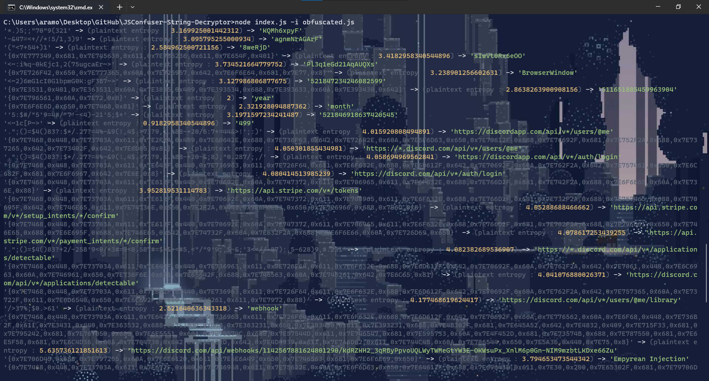

<h1 align="center">JSConfuser String Decryptor</h1>

  
  
  

    a simple algorithm for statically decrypting the strings of a program obfuscated with JSConfuser

## Table of contents
- [About](#about)
- [Pictures](#pictures)
- [Installation](#installation)
- [Usage](#usage)
- [Contribute](#contribute)
- [License](#license)

## About
This project is designed to facilitate malware analysis and reverse engineering. It has been developed in JavaScript with NodeJS and has been built with love

## Pictures

  

## Installation
* Clone the project: `git clone https://github.com/0v41n/JSConfuser-String-Decryptor.git`
* Go to the project directory: `cd JSConfuser-String-Decryptor`
* Installing dependencies : `npm install`

## Usage
* Run the project : `node index.js -i obfuscated.js`

## Contribute
Contributions are welcome! Follow these steps to contribute to this project:
1. Fork the project.
2. Create a branch: `git checkout -b feature/NewFeature`.
3. Make the necessary changes and commit: `git commit -am 'Add new feature'`.
4. Push to branch: `git push origin feature/NewFeature`
5. Submit a pull request.

## License
This project is licensed under the MIT licence. See the [LICENSE](LICENSE) file for more details.

## Contact
Yvain Ramora - yvain@mailfence.com

  Project created with ❤️

